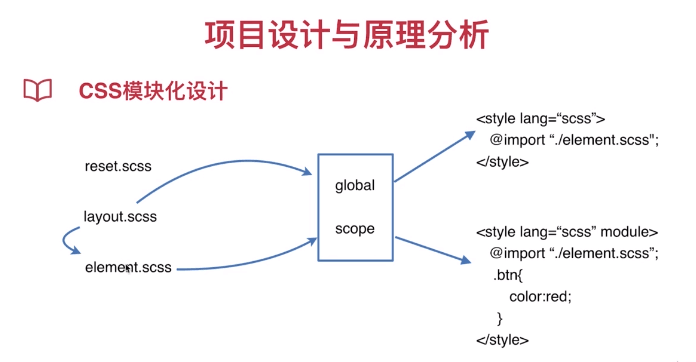

* three.js的彩图示例：
https://www.packtpub.com/sites/default/files/downloads/2215OS_Graphics.pdf

* 前端博客：
http://codingfishman.github.io
http://codingfishman.github.io/2016/05/06/prerender%E9%A2%84%E6%B8%B2%E6%9F%93%E4%BC%98%E5%8C%96SEO/

# 项目设计与原理分析

* 1、设计意义
1. 前后端分离
2. 减轻服务器压力
3. 增强用户体验
4. Prerender预渲染优化SEO
* 2、工作原理
1. History API 
2. Hash
    

        &copy; 2004 Foo Corporation
    

    

