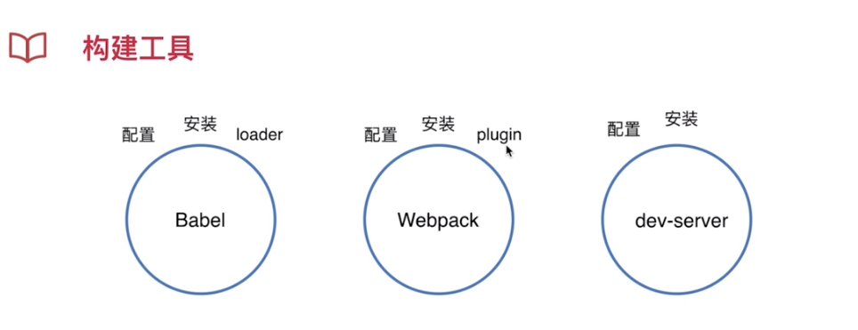

###Welcome to use MarkDown

## 项目设计与原理分析
### css模块化设计
### JS组件设计
### 自适应
### SPA设计
### 构建设计
### 上线指导

### css模块化设计 设计原则
* a、可复用能继承要完整
* b、周期性迭代

正确的做法是：今天设计了5个模块，明天有了新的需求的时候我会反思，我之前的模块是需要合并还是需要增加。用迭代的方式控制着代码质量，让模块化设计更加规范和完美
### css模块化设计 设计方法
* a、先整体后部分再颗粒化
布局：做模块抽象出来 
页面：根据产品需求我需要多少页面，页面又怎么样去区分和隔离样式。AB页面样式相似很多，需要去考虑如何抽离拆分模块化
功能：例如按钮，样式不一样，他是可继承的也是可覆盖的。
业务：具体某一项功能、逻辑、交互。移动端有一个返回的东西，返回在形式上就是一个按钮或者一个链接。回退就是刚才说的功能组件，到业务上要继承功能组件的UI，但是要有自己的业务。

* 先抽象再具体
抽象是说：将一些看着长的不一样的东西抽象成一个统一的模块。这个模块通过隐藏、变量配置来达到具体的内容。
例如：面板：标题+容器，有的可以看做是没有标题的。可以抽象出一个列表的东西，列表可以通过一个配置项来控制他是横向的还是纵向的。列表中填充的内容又具体到了不同的东西。列表是通用的，横向列表填充内容之后就是第一个面板和第四个面板

> 预渲染优化：
http://codingfishman.github.io/2016/05/06/prerender%E9%A2%84%E6%B8%B2%E6%9F%93%E4%BC%98%E5%8C%96SEO/

### 构建设计

